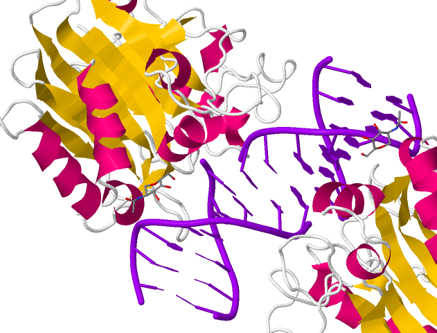
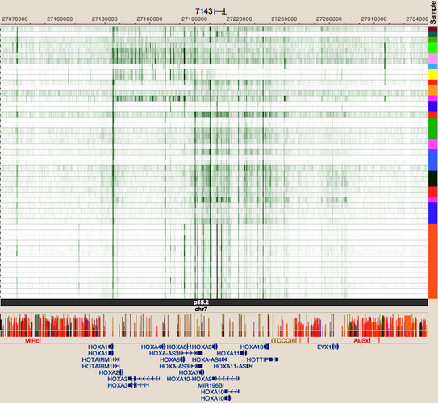
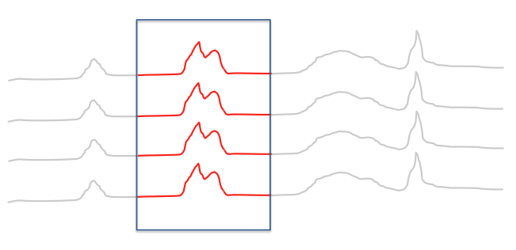
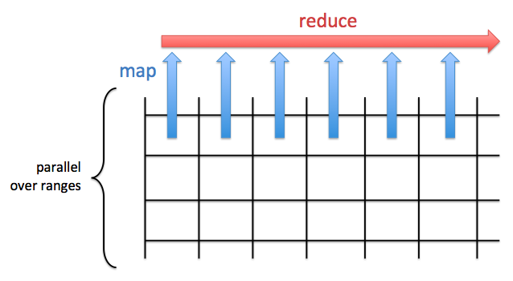

<center>
# GenomicFiles [v1.0](http://www.bioconductor.org/packages/release/bioc/html/GenomicFiles.html)
</center>

<center>
Valerie Obenchain, *Michael Love*, Martin Morgan
</center>

<center>
BioC2014: 1 August 2014
</center>

---

# Example: [DNase I](http://www.rcsb.org/pdb/explore/jmol.do?structureId=2DNJ)

<br>

<center>

</center>

---

# Example: [DNase-Seq](http://epigenomegateway.wustl.edu/browser/) of many cell types

<center>

</center>

---

# My solution in 2011

- BEDTools: reads in 200 bp windows for 100+ samples
- Load bin-level counts into R as a large sparse matrix

<br>

$$
\begin{array}{cccc}
. & . & 6 & 7 & . & 1 & . & . \\
. & 3 & . & . & . & . & . & . \\
. & . & . & . & . & . & 2 & . \\
. & . & . & . & . & . & . & . \\
3 & 9 & . & 5 & 2 & 8 & 1 & 6 \\
. & . & . & . & . & . & . & 1 \\
. & . & . & 5 & . & . & . & . \\
2 & . & . & . & . & . & . & . 
\end{array}
$$

---

# Limitations to this approach

<br>

- [Matrix](http://cran.r-project.org/web/packages/Matrix/index.html) multiplication $X^t X$ possible, but slow (2 hours)
- Limits on functions: only sparse $\rightarrow$ sparse
- Must threshold low counts to stay < 10^9
- For mammalian genome, limited to 100s of samples

<br>

`cannot allocate vector of length ...`

---

# Views approach

Each range is said to represent a *view* onto the sequence.

```{r,echo=FALSE}
library(IRanges)
```

```{r}
library(IRanges)
(x <- Rle(c(rep(0,5),1:5)))
(v <- Views(x, IRanges(4,7)))
```

---

# Operating on views

```{r}
v[[1]] * 10
viewApply(v, function(z) z * 10)
```

---

# Going back to epigenetic tracks

Want to load only one range at a time, no limit on # of files

<br>

<center>

</center>

---

# Request to bioc-devel

<br><br>

Nov 2013 ML: "BigWigViews would be incredibly useful for genomics applications
where we want to scan along the genome looking at lots of samples."

Dec 2013 VO: "I've started a package called GenomicFileViews ...
to provide infrastructure for parallel execution over a group of common file types"

---

```{r, echo=FALSE}
library(GenomicFiles)
library(rtracklayer)
files <- list.files("~/data/bigwig",full=TRUE)
names(files) <- paste0("A549.",1:4)
ranges <- GRanges(Rle(c("chr1", "chr2"), c(3, 3)),
                  IRanges(1 + 11:16 * 1e6, width=1e6))
```

```{r}
library(GenomicFiles)
bwfv <- BigWigFileViews(files, fileRange=ranges)
bwfv
```

---

```{r}
se <- coverage(bwfv)
class(se)
assay(se)[1,1]
```

---

```{r}
se <- summary(bwfv)
assay(se)
```

---

# Again: [DNase-Seq](http://epigenomegateway.wustl.edu/browser/) of many cell types

<center>

</center>

---

# map / reduce task: add sparse coverage

<br><br>

<center>

</center>

*note: reduce step is within one branch of the parallelization*

---

# map / reduce task: add sparse coverage

<br>

Building up to a map function:

```{r}
file <- files[1]
range <- ranges[1]
import(BigWigFile(file), which=range, as="Rle")[range]

MAPPER = function(range, file, ...) {
  import(BigWigFile(file), which=range, as="Rle")[range][[1]]
}
```

---

# map / reduce task: add sparse coverage

<br><br>

Reduce step merely adds the Rle's:

```{r}
REDUCER = function(mapped, ...) {
  Reduce("+", mapped)
}
```

---

# map / reduce task: add sparse coverage

Run it with `reduceByRange()`

```{r}
library(BiocParallel)
register(SerialParam()) # MulticoreParam(workers=10)
res <- reduceByRange(ranges, files, MAPPER, REDUCER)
length(res)
res[[1]]
```

*Genomic Files v1.1 (devel branch) syntax*

---

# Files supported

- Bam
- BigWig
- FASTA
- potentially extensible to tabix, VCF?

---

# Next

- Profiling
    - w/o tweaking, coverage sum is 2-3x WiggleTools
- Guide user wrt optimization of range width
    - `tileGenome()`
- Suggestions?

<br>

Thanks:
- Valerie Obenchain
- Martin Morgan
- Rafael Irizarry & Kasper Hansen
