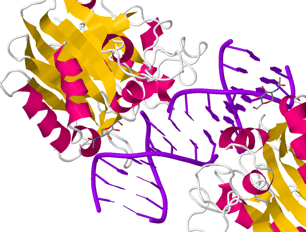

<center>
# GenomicFiles [v1.0](http://www.bioconductor.org/packages/release/bioc/html/GenomicFiles.html)
</center>

<center>
Valerie Obenchain, *Michael Love*, Martin Morgan
</center>

<center>
BioC2014: 1 August 2014
</center>

---

# Example: [DNase I](http://www.rcsb.org/pdb/explore/jmol.do?structureId=2DNJ)

<br>

<center>

</center>

---

# Example: [DNase-Seq](http://epigenomegateway.wustl.edu/browser/) of many cell types

<center>

</center>

---

# My solution in 2011

- BEDTools: reads in 200 bp windows for 100+ samples
- Load bin-level counts into R as a large sparse matrix

<br>

$$
\begin{array}{cccc}
. & . & 6 & 7 & . & 1 & . & . \\
. & 3 & . & . & . & . & . & . \\
. & . & . & . & . & . & 2 & . \\
. & . & . & . & . & . & . & . \\
3 & 9 & . & 5 & 2 & 8 & 1 & 6 \\
. & . & . & . & . & . & . & 1 \\
. & . & . & 5 & . & . & . & . \\
2 & . & . & . & . & . & . & . 
\end{array}
$$

---

# Limitations to this approach

<br>

- [Matrix](http://cran.r-project.org/web/packages/Matrix/index.html) multiplication $X^t X$ possible, but slow (2 hours)
- Limits on functions: only sparse $\rightarrow$ sparse
- Must threshold low counts to stay < 10^9
- For mammalian genome, limited to 100s of samples

<br>

`cannot allocate vector of length ...`

---

# Views approach

Each range is said to represent a *view* onto the sequence.


```r
library(IRanges)
(x <- Rle(c(rep(0,5),1:5)))
```

```
## numeric-Rle of length 10 with 6 runs
##   Lengths: 5 1 1 1 1 1
##   Values : 0 1 2 3 4 5
```

```r
(v <- Views(x, IRanges(4,7)))
```

```
## Views on a 10-length Rle subject
## 
## views:
##     start end width
## [1]     4   7     4 [0 0 1 2]
```

---

# Operating on views


```r
v[[1]] * 10
```

```
## numeric-Rle of length 4 with 3 runs
##   Lengths:  2  1  1
##   Values :  0 10 20
```

```r
viewApply(v, function(z) z * 10)
```

```
## [[1]]
## numeric-Rle of length 4 with 3 runs
##   Lengths:  2  1  1
##   Values :  0 10 20
```

---

# Going back to epigenetic tracks

Want to load only one range at a time, no limit on # of files

<br>

<center>

</center>

---

# Request to bioc-devel

<br><br>

Nov 2013 ML: "BigWigViews would be incredibly useful for genomics applications
where we want to scan along the genome looking at lots of samples."

Dec 2013 VO: "I've started a package called GenomicFileViews ...
to provide infrastructure for parallel execution over a group of common file types"

---


```r
library(GenomicFiles)
bwfv <- BigWigFileViews(files, fileRange=ranges)
bwfv
```

```
## BigWigFileViews dim: 6 ranges x 4 samples 
## names: wgEncodeCshlLongRnaSeqA549CellLongnonpolyaMinusRawSigRep1.bigWig wgEncodeCshlLongRnaSeqA549CellLongnonpolyaMinusRawSigRep2.bigWig wgEncodeCshlLongRnaSeqA549CellLongnonpolyaPlusRawSigRep1.bigWig wgEncodeCshlLongRnaSeqA549CellLongnonpolyaPlusRawSigRep2.bigWig 
## detail: use fileList(), fileSample(), fileRange(), ...
```

---


```r
se <- coverage(bwfv)
class(se)
```

```
## [1] "SummarizedExperiment"
## attr(,"package")
## [1] "GenomicRanges"
```

```r
assay(se)[1,1]
```

```
## $A549.1
## RleList of length 1
## $chr1
## numeric-Rle of length 1000000 with 17226 runs
##   Lengths:  7096     2    14     1  2060 ...  1958    52  1304    76  1799
##   Values :     0     4   168     1     0 ...     0     1     0     1     0
```

---


```r
se <- summary(bwfv)
assay(se)
```

```
##      A549.1 A549.2 A549.3 A549.4
## [1,] 16.61  13.9   13.03  10.35 
## [2,] 39.07  30.96  12.95  11.44 
## [3,] 2.924  2.433  4.03   3.46  
## [4,] 2.405  2.022  2.738  2.55  
## [5,] 9.853  8.324  11.86  9.503 
## [6,] 2.064  1.725  3.031  2.758
```

---

# Again: [DNase-Seq](http://epigenomegateway.wustl.edu/browser/) of many cell types

<center>

</center>

---

# map / reduce task: add sparse coverage

<br><br>

<center>

</center>

*note: reduce step is within one branch of the parallelization*

---

# map / reduce task: add sparse coverage

<br>

Building up to a map function:


```r
file <- files[1]
range <- ranges[1]
import(BigWigFile(file), which=range, as="Rle")[range]
```

```
## RleList of length 1
## $chr1
## numeric-Rle of length 1000000 with 17226 runs
##   Lengths:  7096     2    14     1  2060 ...  1958    52  1304    76  1799
##   Values :     0     4   168     1     0 ...     0     1     0     1     0
```

```r
MAPPER = function(range, file, ...) {
  import(BigWigFile(file), which=range, as="Rle")[range][[1]]
}
```

---

# map / reduce task: add sparse coverage

<br><br>

Reduce step merely adds the Rle's:


```r
REDUCER = function(mapped, ...) {
  Reduce("+", mapped)
}
```

---

# map / reduce task: add sparse coverage

Run it with `reduceByRange()`


```r
library(BiocParallel)
register(SerialParam()) # MulticoreParam(workers=10)
res <- reduceByRange(ranges, files, MAPPER, REDUCER)
length(res)
```

```
## [1] 6
```

```r
res[[1]]
```

```
## numeric-Rle of length 1000000 with 42901 runs
##   Lengths:  641   14 3097   76   17   76 ...    8    3    5   35   23    1
##   Values :    0    8    0    2    0    2 ...    4    5    3    2    3    2
```

*Genomic Files v1.1 (devel branch) syntax*

---

# Files supported

- Bam
- BigWig
- FASTA
- potentially extensible to tabix, VCF?

---

# Next

- Profiling
    - w/o tweaking, coverage sum is 2-3x WiggleTools
- Guide user wrt optimization of range width
    - `tileGenome()`
- Suggestions?

<br>

Thanks:
- Valerie Obenchain
- Martin Morgan
- Rafael Irizarry & Kasper Hansen
