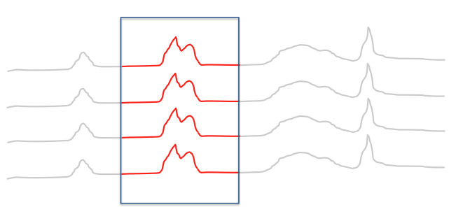

<center>
# GenomicFiles [v1.0](http://www.bioconductor.org/packages/release/bioc/html/GenomicFiles.html)
</center>

<center>
Valerie Obenchain, Michael Love, Martin Morgan
</center>

<center>
BioC2014: 1 August 2014
</center>

---

# Example: epigenetic profiling of cell types

<br>

<center>

</center>

---

# My solution in 2011

- BEDTools: reads in 200 bp windows for 100+ samples
- Load bin-level counts into R as a large sparse matrix

<br>

$$
\begin{array}{cccc}
. & . & 6 & 7 & . & 1 & . & . \\
. & 3 & . & . & . & . & . & . \\
. & . & . & . & . & . & 2 & . \\
. & . & . & . & . & . & . & . \\
3 & 9 & . & 5 & 2 & 8 & 1 & 6 \\
. & . & . & . & . & . & . & 1 \\
. & . & . & 5 & . & . & . & . \\
2 & . & . & . & . & . & . & . 
\end{array}
$$

---

# Limitations to this approach

<br>

- Matrix multiplication $X^t X$ possible, but slow (2 hours)
- Limits on functions: only sparse $\rightarrow$ sparse
- Must threshold low counts to stay < 10^9
- For mammalian genome, seemed limited to 100s of samples

<br>

`cannot allocate vector of length ...`

---

# Views approach

Each range is said to represent a *view* onto the sequence.


```r
library(IRanges)
(x <- Rle(c(rep(0,5),1:5)))
```

```
## numeric-Rle of length 10 with 6 runs
##   Lengths: 5 1 1 1 1 1
##   Values : 0 1 2 3 4 5
```

```r
(v <- Views(x, IRanges(4,7)))
```

```
## Views on a 10-length Rle subject
## 
## views:
##     start end width
## [1]     4   7     4 [0 0 1 2]
```

---

# Operating on views


```r
v[[1]] * 10
```

```
## numeric-Rle of length 4 with 3 runs
##   Lengths:  2  1  1
##   Values :  0 10 20
```

```r
viewApply(v, function(z) z * 10)
```

```
## [[1]]
## numeric-Rle of length 4 with 3 runs
##   Lengths:  2  1  1
##   Values :  0 10 20
```

---

# Going back to epigenetic tracks

Want to load only one region at a time, no limit on # of files

<br>

<center>

</center>

---

# Request to bioc-devel

<br><br>

Nov 2013 ML: "BigWigViews would be incredibly useful for genomics applications
where we want to scan along the genome looking at lots of samples."

Dec 2013 VO: "I've started a package called GenomicFileViews ...
to provide infrastructure for parallel execution over a group of common file types"

---


```r
library(GenomicFiles)
bwfv <- BigWigFileViews(files, fileRange=ranges)
bwfv
```

```
## BigWigFileViews dim: 6 ranges x 4 samples 
## names: test.bw test.bw.1 test.bw.2 test.bw.3 
## detail: use fileList(), fileSample(), fileRange(), ...
```

---


```r
se <- coverage(bwfv)
class(se)
```

```
## [1] "SummarizedExperiment"
## attr(,"package")
## [1] "GenomicRanges"
```

```r
assay(se)[4,1]
```

```
## [[1]]
## RleList of length 1
## $chr2
## numeric-Rle of length 100 with 2 runs
##   Lengths:    50    50
##   Values : -0.75  -0.5
```

---


```r
se <- summary(bwfv)
assay(se)
```

```
##      [,1]   [,2]   [,3]   [,4]  
## [1,] -1     -1     -1     -1    
## [2,] -0.875 -0.875 -0.875 -0.875
## [3,] -0.75  -0.75  -0.75  -0.75 
## [4,] -0.625 -0.625 -0.625 -0.625
## [5,] 0.25   0.25   0.25   0.25  
## [6,] 0.375  0.375  0.375  0.375
```

---

# map / reduce 


```r
file <- files[1]
range <- ranges[4]
import(BigWigFile(file), which=range, as="Rle")[range]
```

```
## RleList of length 1
## $chr2
## numeric-Rle of length 100 with 2 runs
##   Lengths:    50    50
##   Values : -0.75  -0.5
```

```r
MAPPER = function(range, file, ...) {
  import(BigWigFile(file), which=range, as="Rle")[range][[1]]
}
```

---

# map / reduce


```r
REDUCER = function(mapped, ...) {
  Reduce("+", mapped)
}
```

---

# map / reduce


```r
library(BiocParallel)
register(SerialParam()) # MulticoreParam(workers=4)
res <- reduceByRange(ranges, files, MAPPER, REDUCER)
length(res)
```

```
## [1] 6
```

```r
res[[4]]
```

```
## numeric-Rle of length 100 with 2 runs
##   Lengths: 50 50
##   Values : -3 -2
```

---

# Files supported

- Bam
- BigWig
- FASTA
- (tabix, VCF)

---

# Next

- Profiling
- Guide user wrt optimization of region size
- Suggestions?

Thanks:
- Valerie Obenchain
- Martin Morgan
- Rafael Irizarry
- Kasper Hansen
